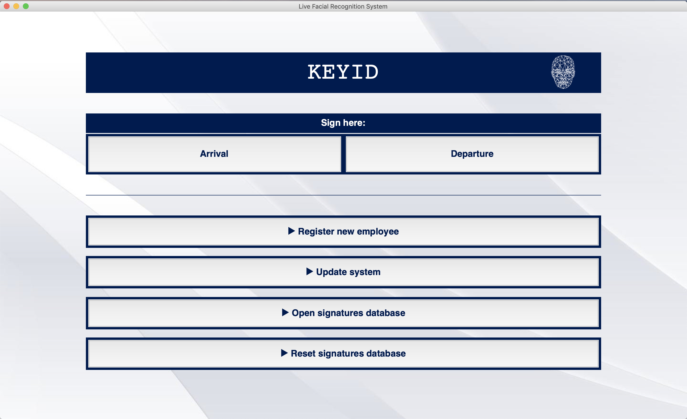
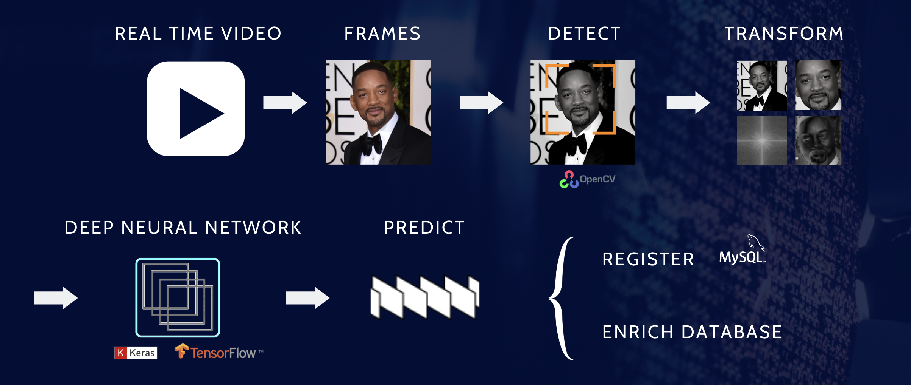

## Overview

KeyID is a facial recognition system oriented to improve the sign-in-work process and registration. 

It is intented o facilitate the compliance with the [new spanish law](https://www.boe.es/buscar/doc.php?id=BOE-A-2019-3481) which compels all companies to register the the workdays of their employees. In addition, KeyID aims to improve other other registration systems such as card detection which can be easily bypassed, and therefore to provide an economic but reliable employee recognition system.

## Interface description

This is the KeyID app interface, which allows for the following functionalities:
- The employees may sign every time by clicking either arrival or departure, which leads the program to:
    1. Predict who is the person in front of the camera (computer webcam in this case) in case it is an employee and to inform of not recognition in case it is an outsider. 
    2. Generate an entry in an SQL table with the time and name of the registered person.
    3. Take and save some frames of the person to enrich the images database, as the aspect of people vary over time.
- The administrators of the app may:
    1. Register a new employee. It activates the camera to record a video of the new employee and saves the frames to the database.
    2. Update system, which is basically to train the model with the new inputs. However, through the script train_scheduled.py the model is programmed to be retrained every night.
    3. Open MySQL database to see the records.
    4. Reset MySQL database to a clean one.

### Used tools

For KeyID to be built, these are the tools I used:
- **OpenCV** to frame the faces and for image processing
- **Keras** (**Tensorflow**) for the VGG-like convnet neural network
- **mySQL** for the database
- **TkInter** for the interactive interface

### Next steps

- Integrate a movement detection system (i.e. blinking motion) to avoid fraude by showing a picture to the camera
- Apply online deep learning to my neural network to be able to train the model as the new data from the employees feeds the database and therefore not needing to train everynight with all data